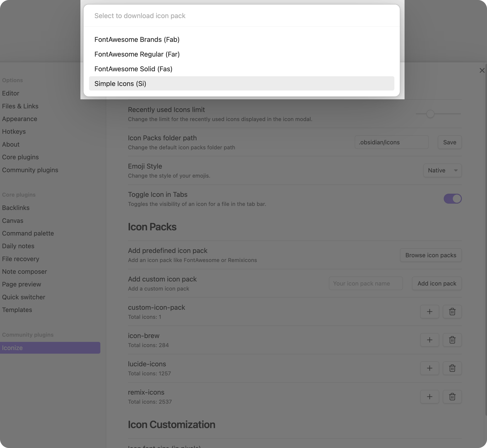
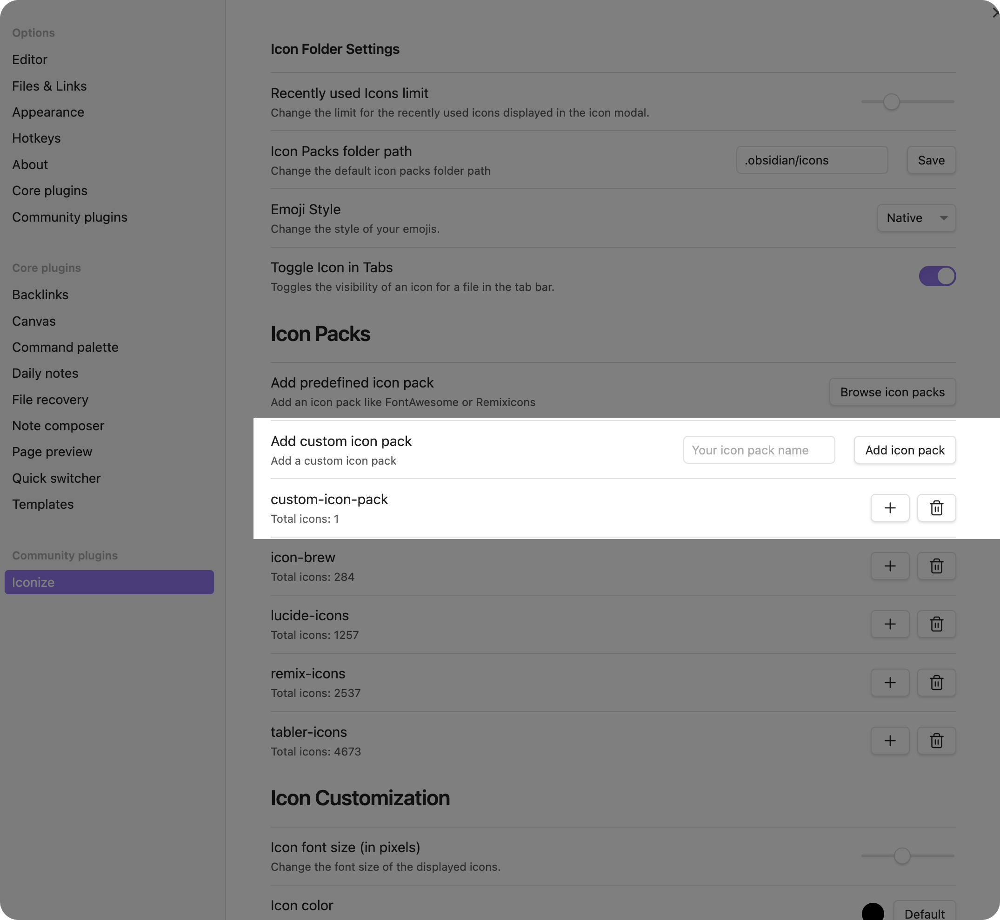
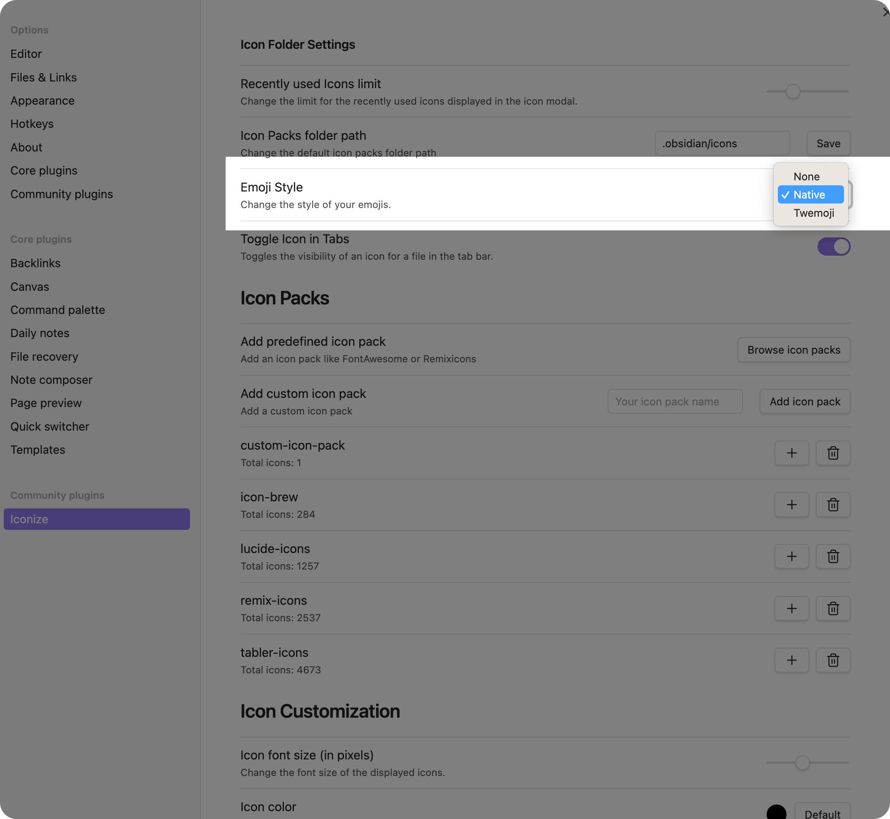

# Icon Packs

GlyphIt comes with some predefined icon packs. However, you can also add your own icon
packs. This section of the documentation will show you how to do that, but also how to use
the predefined icon packs and emojis.

## Predefined Icon Packs

To use a predefined icon pack, you can go to the settings of the plugin and select
`Browse icon packs` and then select the icon pack you want to use. So that the following
modal will open:

After you have selected the icon pack you want to use, it will download the icon pack and
then you can use it in your vault.

Currently, GlyphIt supports the following predefined icon packs:

- [Font Awesome](https://fontawesome.com/)
- [Remix Icons](https://remixicon.com/)
- [Icon Brew](https://iconbrew.com/)
- [Simple Icons](https://simpleicons.org/)
- [Lucide Icons](https://lucide.dev/)
- [Tabler Icons](https://tabler-icons.io/)
- [BoxIcons](https://boxicons.com/)
- [RPG Awesome](http://nagoshiashumari.github.io/Rpg-Awesome/)
- [coolicons](https://coolicons.cool/)
- [Feather Icons](https://feathericons.com/)

If you want to add a predefined icon pack or you would like to update an existing one,
feel free to open a pull request on
[GitHub](https://github.com/jmarasch/glyphit/compare).

## Custom Icon Packs

::: tip NOTE

This feature is currently not 100% available and stable. If you want to use it, you can
do that, but it might be that some things are not working as expected. Furthermore, there
might be some breaking changes in the future.

:::

If you want to add your own icon pack, you can do that by using the option `Add icon pack`
in the plugin settings of GlyphIt. You just need to enter the name of the icon pack.
After that, you can add the icons you want to use in your vault by using the plus icon (`+`)
next to the custom icon pack.

When creating a custom icon pack you can choose how it is stored: as an
**archive (`.zip`)** or as a **folder**. An archive keeps every icon in one
file, which is far kinder to file syncing and to directory watchers; a folder
is easier to edit by hand.

Either way you can add SVGs to the pack from the settings page, with the `+`
button or by dragging files onto it — GlyphIt writes them into the archive or
folder for you. Icon packs live in the icon packs folder (`.obsidian/icons` by
default), and the folder-open button next to each pack opens it in your file
browser.

::: tip NOTE

After editing a pack outside Obsidian, use the rescan button next to it in the
settings to pick the changes up without restarting.

:::

## Using Emojis

If you want to use emojis in your vault, you can do that by using the built-in functionality
of GlyphIt. You can directly use emojis in the icon picker by searching for them. You can
search for emojis by using the name of the emoji or by using the emoji itself.

Furthermore, you can also adapt the style of the emoji by choosing the emoji style in the
settings of GlyphIt. You can choose between `Native` and `Twemoji`.

